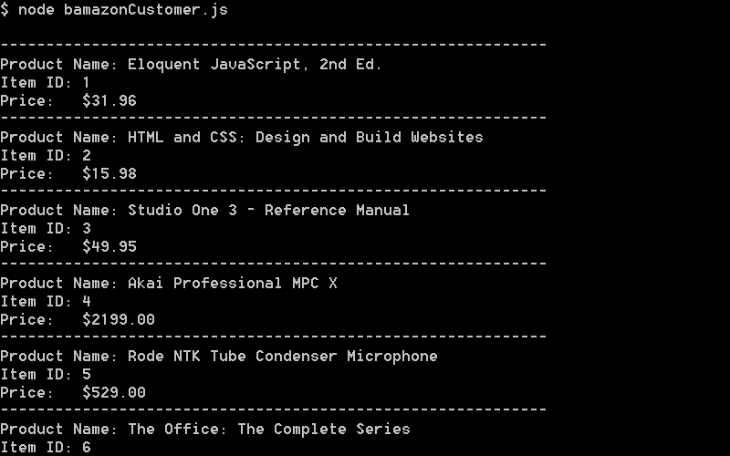
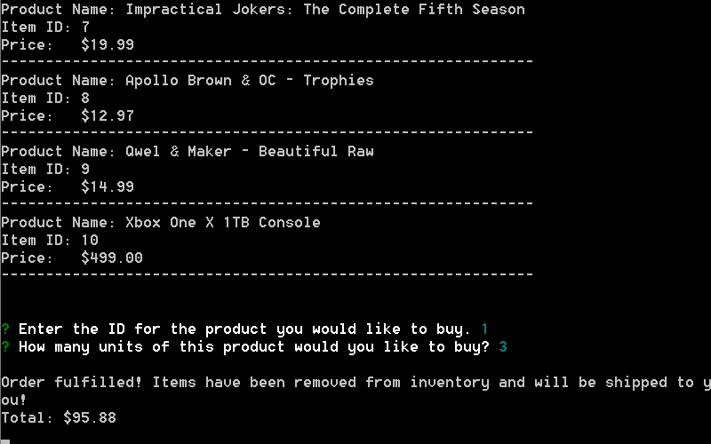
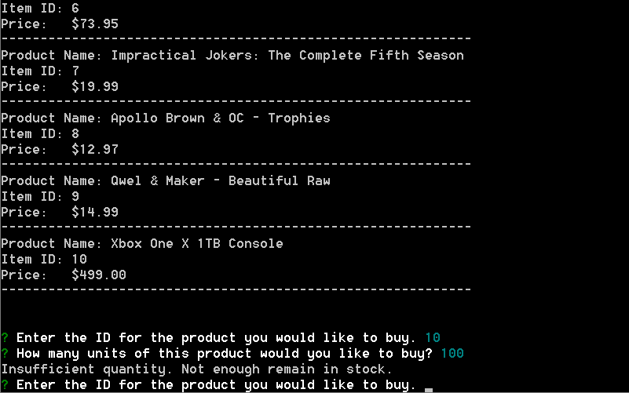
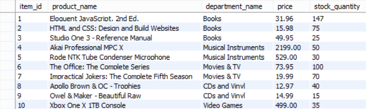

# Bamazon

### Overview

This CLI application creates a mock Amazon-like storefront using MySQL and Node.js with the npm `inquirer` and `mysql` packages.

### Installation

Download or clone the repository and run `npm install` to ensure project dependencies are available.

*Prerequisites: Node.js and MySQL*

### How It Works

Simply run `node bamazonCustomer.js` in the terminal to start the program.

A list of items for sale are displayed, including their product ID, name, and price.  

**Screenshot #1 - Product Display**   

An `inquirer` prompt message gets the ID of the product the user would like to buy and how many units of the product they need.  

**Screenshot #2 - `inquirer` Prompt**   

When an order is placed, the application checks to see if the store has enough of the product to meet the customer's request.

If not, a message is displayed informing the customer there are not enough items in stock. In the case below, the store only has 35 Xbox One X 1TB Consoles in stock, but the user tried to order 100.  

**Screenshot #3 - Insufficient Quantity**   

If there are enough items in stock, the SQL database is updated to reflect the remaining quantity and the customer is shown the total cost of their purchase.  

**Screenshot #4 - SQL Database Updated**   

## Authors
* **Justin Flick** - *Everything*